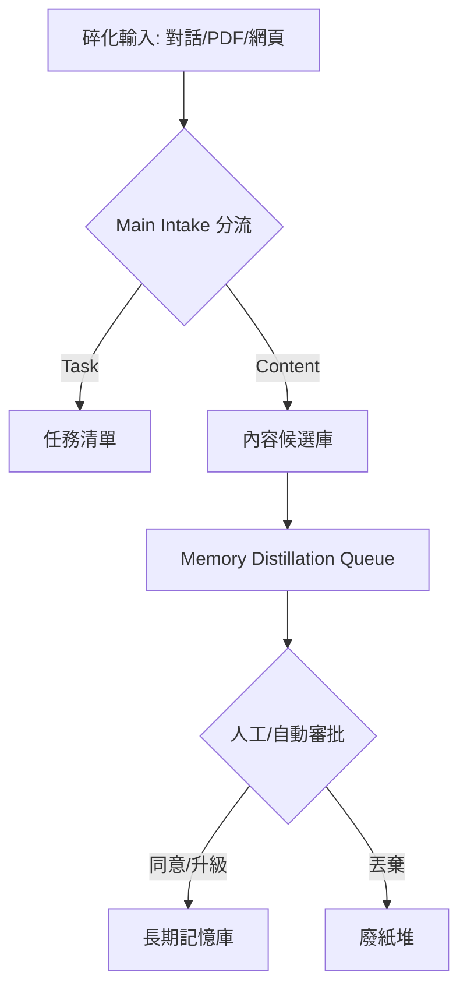

# 從對話到技能：OpenClaw 如何將「碎化知識」煉成 AI 自動化分身

## 前言
- **作者背景**：由 OpenClaw 開發者社群（以河馬 Hamster 為形象標誌）所打造的個人 AI 基礎設施。
- **影片核心**：展示如何透過「攝入、蒸餾、養成」三大流程，將散落在通訊軟體與網頁中的資訊，自動轉化為 AI 的原生技能。
- **讀者獲益**：
  - 理解 OpenClaw 系統如何透過 Obsidian 實現自動化的知識蒸餾。
  - 掌握「桌面河馬」入口與「對話入口」的協作邏輯。
  - 學會如何將長期記憶「升級」為可執行的 AI Skills。

---

在傳統的知識管理中，我們最常遇到的瓶頸是「收藏即廢紙」。無論是與 AI 的精彩對話，還是隨手存下的網頁與 PDF，往往只是靜靜地躺在數據庫裡，難以轉化為真正的生產力。

這支影片展示了 **OpenClaw AI 分身系統** 的核心邏輯：它不只是在「存筆記」，而是在「養技能」。透過一套嚴密的蒸餾與自動化機制，系統能將你感興趣的任何資訊，最終轉化為 AI 能夠反覆執行的原生 Skills。

## 多維度攝入：打破「對話即唯一」的資訊限制

要打造一個懂你的 AI 分身，第一步是確保它能全面接收你的數位足跡。OpenClaw 系統設計了兩個互補的入口來解決這個問題：

1. **日常對話入口**：不論你使用 Telegram、LINE 或 Discord 與 OpenClaw 溝通，所有的任務指令與對話脈絡都會被自動捕獲。例如，當你要求它總結一篇 Anthropic 的文章時，這段互動本身就具備了高價值的知識特徵。

2. **桌面河馬 (Hamster) 入口**：這是一個位於桌面上的視覺化小工具。你可以直接將 PDF 文件拖進去，或貼上長文本與網頁網址。這個入口解決了真實工作場景中，大量「原材料」來自於非對話媒介的問題。系統會像「吃掉」資訊一樣將其納入本地系統，確保資料的私密性。

## 內容蒸餾流程：從碎化資訊到長期記憶

資訊進入系統後，會經歷一系列的「加工層級」。這些過程主要在 Obsidian 中完成，但由 Agent 自動執行：

1. **Main Intake (初步分流)**：系統自動判斷類型，標記為 Task、Decision 或 Research Material。
2. **正式化沉淀**：評估值得長期保留的內容，將其掛載到 Markdown 文件中。
3. **Memory Distillation Queue (內容蒸餾)**：大模型從中提煉出精華，形成更短、更易檢索的「候選記憶」。
4. **審批鏈條**：每條候選記憶面臨**同意、合併、升級、或丟掉**四種命運。

## 從記憶到能力：如何「養成」自動化 Skills

OpenClaw 與一般 AI 助手最大的區別在於：它能發現「重複的價值」。

當系統偵測到某種處理模式或知識路徑被反覆證明有效時，它會將這些長期記憶進一步「升級」為 **OpenClaw 原生 Skills**。

這些養出來的能力會出現在 `Main Skill Pack` 頁面中，具備明確的觸發條件與可靠程度標註。這意味著你的 AI 分身不是在學習「如何回答問題」，而是在學習「如何像你一樣完成工作」。

## 系統定制與平台限制

使用者透過明確五個維度來引導系統進化：
- 優先處理的事情類型
- 值得長期留下的內容標準
- 應被忽略的噪音
- 常見的重複工作流程
- 未來希望擅長的特定領域

**技術限制**：目前 macOS 提供完整支援（含桌面河馬）；Linux 暫時無法使用桌面入口，但核心功能完整。

## 結論與洞察：從「筆記管理」轉向「能力養殖」

這支影片揭示了一個趨勢：未來的個人知識管理（PKM）將不再以「檢索」為終點，而以「自動化」為目標。

真正有價值的不是你「記住了什麼」，而是你的系統如何將這些記憶轉化為可執行的流程。OpenClaw 將知識看作可以「養殖」的生命體——從攝入、消化、蒸餾到最終長成一項技能。這種從「存量思維」到「增量能力」的轉變，才是 AI 分身系統真正能讓使用者「越用越好用」的原因。
