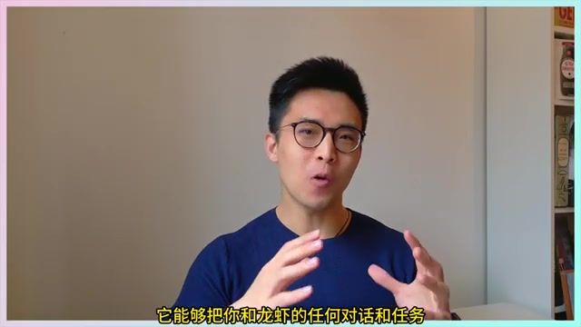
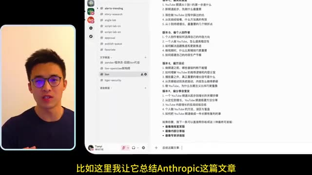
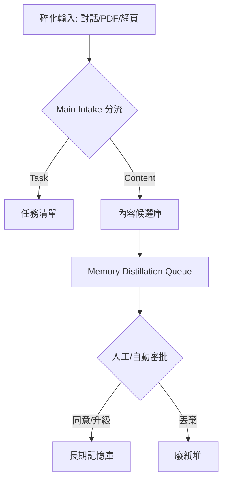
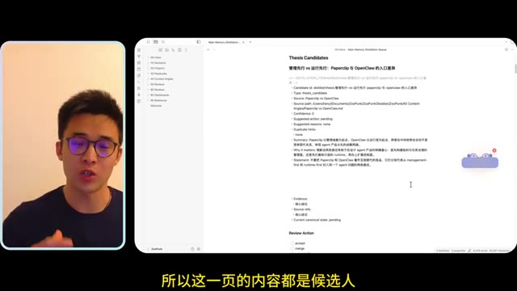
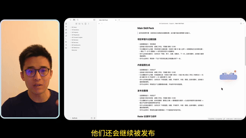

# 從對話到技能：OpenClaw 如何將「碎化知識」煉成 AI 自動化分身

## 前言

大多數人使用 AI 助手的方式是：問一個問題，得到答案，然後結束。就像使用搜尋引擎，只是多了點 intelligence。

但這其實是一個陷阱：對話結束後，AI 幾乎什麼都沒有記住。

所謂的「AI 助手」實際上是「無記憶的智力服務」。每一次對話都是獨立的碎片，無法累積、無法沉澱、無法長成真正的能力。

OpenClaw 給出了不一樣的答案。它不只讓 AI 回答問題，而是讓 AI 從你所有的對話、網頁、PDF 中自動提煉知識，養出屬於你的技能分身。

**作者背景**：B 站技術 UP 主「木子不写代码」，長期追蹤並實測各種 AI 工具與自動化系統。本片是其對 OpenClaw 系統從攝入到技能養成的完整解說。

**讀者獲益**：
- 理解「攝入 → 蒸餾 → 養成」三層架構的運作邏輯
- 學會用「桌面河馬」與「對話入口」構成雙通道攝入系統
- 掌握將長期記憶升級為可執行 AI Skills 的具體方法

## 多維度攝入：打破「對話即唯一」的資訊限制

要打造一個懂你的 AI 分身，第一步是確保它能全面接收你的數位足跡。OpenClaw 系統設計了兩個互補的入口來解決這個問題：

1. **日常對話入口**：不論你使用 Telegram、LINE 或 Discord 與 OpenClaw 溝通，所有的任務指令與對話脈絡都會被自動捕獲。例如，當你要求它總結一篇 Anthropic 的文章時，這段互動本身就具備了高價值的知識特徵。

2. **桌面河馬 (Hamster) 入口**：這是一個位於桌面上的視覺化小工具。你可以直接將 PDF 文件拖進去，或貼上長文本與網頁網址。這個入口解決了真實工作場景中，大量「原材料」來自於非對話媒介的問題。系統會像「吃掉」資訊一樣將其納入本地系統，確保資料的私密性。

## 內容蒸餾流程：從碎化資訊到長期記憶

資訊進入系統後，會經歷一系列的「加工層級」。這些過程主要在 Obsidian 中完成，但由 Agent 自動執行：

1. **Main Intake (初步分流)**：系統自動判斷類型，標記為 Task、Decision 或 Research Material。
2. **正式化沉淀**：評估值得長期保留的內容，將其掛載到 Markdown 文件中。
3. **Memory Distillation Queue (內容蒸餾)**：大模型從中提煉出精華，形成更短、更易檢索的「候選記憶」。
4. **審批鏈條**：每條候選記憶面臨**同意、合併、升級、或丟掉**四種命運。

## 從記憶到能力：如何「養成」自動化 Skills

OpenClaw 與一般 AI 助手最大的區別在於：它能發現「重複的價值」。

當系統偵測到某種處理模式或知識路徑被反覆證明有效時，它會將這些長期記憶進一步「升級」為 **OpenClaw 原生 Skills**。

這些養出來的能力會出現在 `Main Skill Pack` 頁面中，具備明確的觸發條件與可靠程度標註。這意味著你的 AI 分身不是在學習「如何回答問題」，而是在學習「如何像你一樣完成工作」。

## 系統定制與平台限制

使用者透過明確五個維度來引導系統進化：
- 優先處理的事情類型
- 值得長期留下的內容標準
- 應被忽略的噪音
- 常見的重複工作流程
- 未來希望擅長的特定領域

**技術限制**：目前 macOS 提供完整支援（含桌面河馬）；Linux 暫時無法使用桌面入口，但核心功能完整。

## 結論與洞察：從「筆記管理」轉向「能力養殖」

這支影片揭示了一個趨勢：未來的個人知識管理（PKM）將不再以「檢索」為終點，而以「自動化」為目標。

真正有價值的不是你「記住了什麼」，而是你的系統如何將這些記憶轉化為可執行的流程。OpenClaw 將知識看作可以「養殖」的生命體。從攝入、消化、蒸餾到最終長成一項技能，這種從「存量思維」到「增量能力」的轉變，才是 AI 分身系統真正能讓使用者「越用越好用」的原因。

---

### 🔮 超越影片的洞察

這套系統帶來一個更深的問題：

**如果你的 AI 分身每天都在吸收你的決策方式，它最終會變成什麼？**

當系統開始基於「重複成功的模式」自動升級 Skills，你的 AI 分身就不再只是一個工具，而是一個你親手養成的數位分身。它做決策的方式，就是你教它做決策的方式。

但這種「能力養殖」也有代價：

- **認知負荷的轉移**：你從「自己做」變成「監督系統演化」。一開始是解脫，久了可能失去對系統的直覺理解。
- **蒸餾失真**：每一層升級都伴隨著上下文丟失。AI 看到的是「5 件重複工作」，不是背後的人際脈絡與例外情況。
- **系統鎖定風險**：當你的 workflow 與 OpenClaw 深度整合，遷移成本會越來越高。這是一個需要從一開始就正視的工程決策。

真正的「越用越好用」不是魔法，而是有代價的演化。理解這些代價，才能用得更自覺。
